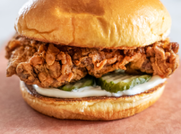

<!-- Liquid:  statements -->

<!-- Include submenu from _includes to top of pages -->

<!--- Concatenation of site URL to frontmatter image  --->

<!--- Has is a list variable containing mario metadata for sprite --->
  
<!--- Size width/height of Sprit images --->


<!--- HTML for page contains 
 tag named "Mario" and class properties for a "sprite"  -->

  
<!--- Embedded Cascading Style Sheet (CSS) rules, 
        define how HTML elements look 
--->

My Name is Ian Manangan and I'm a Junior at Del Norte Highschool. My hobbies are volleyball, biking, and basketball. After school, I practice volleyball, work, and sleep.

This page is a forked page from student_2025, and portfolio_2025.

This is My Nighthawk Homepage. Here are three buttons:

<html>
  <body>
    <h2> Placeholder Button: </h2>
    

    <button id="Chicken">
 This button does nothing...
</button>
         
    <h2> CSP page Button: </h2>
    

    <a href = "navigation/section/csp"><button id="chicken1">
 This button gets you to the CSP page
</button></a>
         
    <h2> DNHS page Button: </h2>
    

    <a href = "https://delnorte.powayusd.com/apps/bell_schedules/"><button id="chicken2">
 This button gets you to DNHS bell schedule
</button></a>
          
    

       

    <h3> EXAMPLE BUTTONS: W/ & W/O LINK </h3>
    <button id = "x">Without</button>
      
    <a href="about:blank"><button id = "x">With</button></a>
  </body>
</html>
